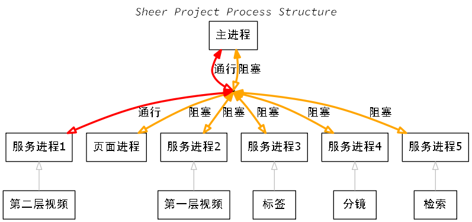
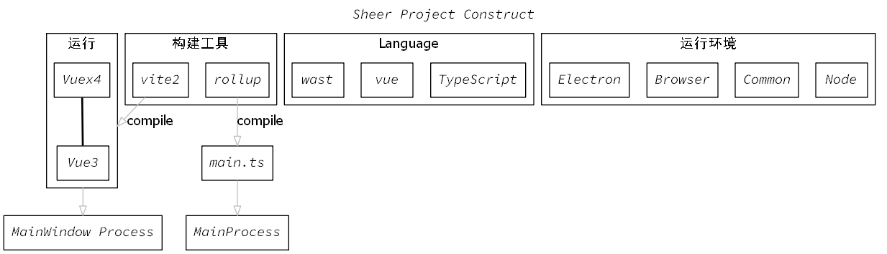

## Structure


 <!--  -->

## IPC
 


## Base on
  - [Electron + vue3 + vite 整合](https:www.jianshu.com/p/ee5ec23d4716)

## Mentality
  - 开始写入：2020年10月27日 星期二 00:21:26
  1. 对现在的两个模式：秩序与混沌，这个我实现的显示层面的最终状态
  2. 对于秩序中我对数量的要求并不是那么强烈，虽说我的那个，但是我可能会去实现一个条形图
  3. 之前我在想的有一个紧凑形的视图设计，但是我在对这个设计的目的有些迷失了，我得先想出这要这样的设计，是否符合我原思想中直观性。
  4. 之前我想主要是由混沌转向秩序，但我对混沌也得做一个分层，也要有一个原本就是处于乱的情况下，再转向稍有点秩序的局面。
  - 解决方案： 
    - 对于我原本存在着被自己不清楚的存在视频文件的规则，导致现在混乱的局面，这样本身就应该是我的问题，我这个软件应该向 Vim 样中的 Make Simple Make Pure，它不是一个帮你清理过去错误的软件，应该保证自己的运行轨道，不应该是来帮助你修补各种的错误
  - 最后修改：2020年10月27日 星期二 17:28:36
  - 实现区别视觉得不能只使用颜色这一个单元素，得有一个多元素组合成一个东西，这样可让可被分类上限增强更多。
  - 对类别与标签的区别得做一个解释
    - 对于默认的建立的文件夹，应该是设为视频文件的一种默认标签，它为默认分组，隶属为视频的一个属性。
    - 对于标签（分类体系）、与视图的互动应该做一个联合，子标签也是一个新的元素
    - 对于标签中的像 **美国的bat man** 这样的应是由一个命名规范来约束，其实还真是我有些没有想清楚，对本地的视频文件、文件夹，它有一个自有系统，我还要想的是兼容它的行为，
    - 文件与文件名的关系，文件所携带的属性
      - 文件名是用来做辨别这个文件的，但是当出现多个文件属一个类那就是另一个操作，将这些文件放入一个新命名的文件夹来作一个单独对象能达到**方便（也就是基于方便思维）**处理，然而实际上我直接能根据多个文件的文件名来做一个智能分类，在原动作上它帮助了取消了一个要进行范围确认的动作，而变成了只有一个要被处理的对象，并且能集体统一处理的能力
    - Vue 的键盘事件应该绑定到被 fcous 的元素上 ，既然我写的全局键盘事件应该是绑定到 body 上，这个函数应该发出信号做出某个动作
  - 文件命名规范
  - 对于默认分类的第一层应该是否添加上字母序这一件事，在非可处理成与字母有关系的字符的情况下不适用，如：`氷`-日文、`악`-韩文，虽它也与字母有关系，但是这个超出我的知识范围内了。也不能允一个为标准文，那又给我增加文字翻译的工作。
    - 解决方案：
      - 是只对它做应该有的排序工作
  - 在数据分流、错误分类上使用一个以某种规律组合成的字序，是能较低运行成本完成多种情况的处理，而当这个规律字序能在编写时以别另一名字使用时，而这一名字再以可读性高的字符组成表达，这样就能既保证了低运行成本，又达到很高的可读性。
  - Cancel Infinite Recursive Read File and Dir with mount on Tree
    - 在最开始的代码设计中，我对读取文件这个功能的设定是越强大越好，所以我将写了一个能无限递归读取文件树，并挂载到 Tree 类上。相反的是，我现在认为更优秀的使用规范比强大的工具健壮。
    - be a better man , not be a better tool , be a least tool
  - 传送出去应该是什么样数据
    - 临时合并
    - 自分组
  - VSCode 源码
    - 思想
      - 依赖注入
      - 服务
    - Electron 性能问题
      - [ ] [Electron 文档](https://www.electronjs.org/docs/tutorial/performance#3-%E9%98%BB%E5%A1%9E%E4%B8%BB%E8%BF%9B%E7%A8%8B)
    - 设计模式
      - 发布/订阅模式
        - 事件发射器
        - 事件
      - 装饰者

## Subproject
  - Rust-Wasm
  - C/C++ - Emscripten
  - golang

## Attention
  - 抽离出来的东西
  - 怎么样的组织代码
  - 将图片的宽高改成 256 × 144 (128 × 72 的两倍) 
    - 这样我好维护，并更容易地控制每一行一个元素的大小
  - 因为处理文件、文件夹需要几个函数，我将它组成一个 File 类 ，经过 File 类中方法的处理（其中有提纯数据）后得到为 Tree 结果
  - 对于将数据处理成有序的样子，与直接使用数据展示出来的，这两个之间的区间即是这个前端与后端应该分开的事
  - 端口为 3000 和 3344
  - rollup 编译成主进程代码，自带有热编译，开了两个服务
  - Source Code
    - 阅读源码时，特别是大型的开源项目，像我这次读的 VSCode 源码的一小块却也是一个完整的 IPC 。一、先了解它整体**结构**设计，再去读它的细节，对于其中的类也是适用这个规则的
    - 不明白的变量，能调试就调试，不能调试就使用打印

## CSS
  - [对img标签使用after和before伪元素失效的原因](https://blog.csdn.net/qq_35630674/article/details/97398054)
## TypeScript
  - `global.d.ts` 当文件中出现 `import` 语句时它将不会是全局作用域，`declare` 也将无效 ，需要重新在 `declare gloabl{...}` 中写不再需要写 `declare` 直接定义
    - Node 全局对象 `global` 上的挂载
    ```ts
    declare global{
      module NodeJS {
          interface Global {
          }
      }
    ```
    - Browser 全局对象 `window` 上的挂载
    ```ts
    declare global{
      module NodeJS {
       interface Window {
       }
      }
    ```

## Python
  - [x] 将 picture.py 或 TypeScript 中的文件添加检查帧是否重复写入


## Rust

## Tool
  - rollup
    - [Rollup 配置详解](https://blog.cjw.design/blog/old/rollup)
    - [Rollup打包工具的使用（超详细，超基础，附代码截图超简单）](https://juejin.cn/post/6844904058394771470)
    - `"dev:ele": "node script/build --env=development --watch",`
    - `"dev:ele": "electron src/main/_.js"`
  - npm
    - [npm scripts 使用指南](http://www.ruanyifeng.com/blog/2016/10/npm_scripts.html)
  - vite
    - 

## Electron
  - 打印当前 Electron 所使用 Node 的 Version 
    - 在 Devtools 中 写 process


## GraphViz
  - Reference
    - [Graphviz (dot) examples](https://renenyffenegger.ch/notes/tools/Graphviz/examples/index)
    - [Using Graphviz to Visualize Structured Content from Contentful Spaces](https://www.contentful.com/blog/2018/05/04/using-graphviz-to-visualize-structured-content-from-contentful-spaces/)
    - [数据可视化（三）基于 Graphviz 实现程序化绘图 (应读)](https://riboseyim.github.io/2017/09/15/Visualization-Graphviz/#%E6%89%A9%E5%B1%95%E9%98%85%E8%AF%BB%EF%BC%9A%E6%95%B0%E6%8D%AE%E5%8F%AF%E8%A7%86%E5%8C%96)
    - [使用python库--Graphviz为论文画出漂亮的示意图 (应看)](https://www.cnblogs.com/marsggbo/p/10327618.html)

## Latex (TikZ & PGF & ctex) 
  - 
## Git
  - [如何规范你的Git commit？](https://zhuanlan.zhihu.com/p/182553920)
  - [Git Commit Guidelines](https://github.com/angular/angular.js/blob/master/DEVELOPERS.md#-git-commit-guidelines)
  - [Git-commit-plugin For Vscode 一款自动生成规范git提交信息的插件](https://juejin.cn/post/6844904088744755208)
## DataStructure
  - [x] Tree.js 的功能增强
  - [ ] libary.ts 中 File 类的查询函数添加函数节流，次数记录，查询限额
    - 改写成 Generator 函数 来控制运行次数 
  - [ ] code level 获取当前程序的运行内存与整个系统的内存大小

## Try
  - AssemblyScript 的试验
  - 可选从网络加载图片

## TODO
  - 设计整体完善
  - 使用滚动到视口窗口中之内 
    - 解决方案
      - 使用 Element.scrollBy 来实现固定滚动距离
  - [x] 将读取文件树的几个文件函数的 Doc 写清楚
  - [x] 数据获取响应成功
  - [x] 处理 js-yaml 函数返回值问题
  - [x] 将 File 的 FileTree 函数运行返回出 checkline 
  - [ ] 将 add.wasm 做成一个 vuex 函数
  - [ ] 寄存器实现
  - [ ] 将 Prism Vue 组件分离出去

## IDEA
  - [x] 对 File 类中能一层的分块，进行一个探索
  - [ ] 对背景做一个滑动过线性东西的动画尝试
  - [ ] 对读取出来的 Tree 进行一个本地文件数据缓存，并要对它先进行规则排序后再缓存，以便于在本地数据变化时没有被响应，能直接反向比较求证。
  - [ ] 直接跳过写入文件，直接进行读取
  - 组合式形容词与名词的关系来作为命名关系
  - 文字编程应该与代码结构可视化互动结合在一起
  - 正文结构适合横向书写，竖向排列，批注适合竖向书写，横向排列。


## Mode
  - 混沌模式
  - 秩序模式
  - 紧凑模式

## For 、Inspiration
  - [qutebrowser](https:qutebrowser.org/)
  - [vimstart](https:github.com/okitavera/vimstart)

## Reference
  - VSCode 
    - 搜索关键词：Monaco源码分析
    - [vscode源码分析【一】从源码运行vscode](https://codeteenager.github.io/vscode-analysis/learn/)
    - [VSCode技术揭秘（一）](https://segmentfault.com/a/1190000020833042?utm_source=tag-newest)
    - [monaco-editor实现全局内容和文件搜索](https://blog.csdn.net/weixin_42084197/article/details/90486243)
    - [VsCode源码分析之布局](https://www.cnblogs.com/youcong/p/10295335.html)
    - [monaco editor各种功能实现总结](https://blog.csdn.net/gao_grace/article/details/88890895)
    - [Monaco Editor使用](https://tangpengfei111.github.io/2019/12/21/monaco-editor%E4%BD%BF%E7%94%A8/)
    - [Editor源码阅读](http://gwiki.cn/2018/01/editor%E6%BA%90%E7%A0%81%E9%98%85%E8%AF%BB)
    - [从 VSCode 看大型 IDE 技术架构](https://zhuanlan.zhihu.com/p/96041706)
    - [如何用最简单的方式解释依赖注入？依赖注入是如何实现解耦的](https://www.zhihu.com/question/32108444/answer/309208647)
    - [文本缓冲区重新实现](https://code.visualstudio.com/blogs/2018/03/23/text-buffer-reimplementation)
    - [vscode源码剖析](https://ashan.org/archives/959)
    - [VSCode技术揭秘（一）](https://segmentfault.com/a/1190000020833042)
    - [vscode源码分析【二】程序的启动逻辑，第一个窗口是如何创建的](https://cloud.tencent.com/developer/article/1454979)
    - [vscode 定制开发 —— Workbench 源码解读及实战](https://zhaomenghuan.js.org/blog/vscode-workbench-source-code-interpretation.html)
    - [VSCode 源码解读 - NLS(多语言) 的实现](https://zhuanlan.zhihu.com/p/107779792)
    - [ ] [VSCode 源码解读：事件系统设计](https://godbasin.github.io/2020/07/05/vscode-event/)
    - [VSCode 多进程架构](https://godbasin.github.io/front-end-playground/front-end-basic/deep-learning/vscode-ipc.html#vscode-%E5%A4%9A%E8%BF%9B%E7%A8%8B%E6%9E%B6%E6%9E%84)
    - [Visual Studio Code 是如何办到高效处理大文件的](https://www.zhihu.com/question/30011019)
    - [vscode编辑器打开大项目能够快速预览，这是如何做到的？软件算法比atom做的好?](https://www.zhihu.com/question/52470898)
    - [Dive Into Code: VSCode 源码阅读（一）](https://zhuanlan.zhihu.com/p/35902370)
    - [vscode 源码解析 - 细数 vscode 中的那些服务](https://zhuanlan.zhihu.com/p/97593534)
    - VSCode Plugin
      - [小记VSCode插件amVim的改进以及插件开发](https://juejin.cn/post/6844903620199055367)
  - Vue
    - [Vue中文件社区](https://www.vue-js.com/)
    - [从Vue3源码中再谈nextTick](https://blog.csdn.net/weixin_44475093/article/details/110003633)
    - [面试官：为什么Vue中的v-if和v-for不建议一起用?](https://blog.csdn.net/weixin_44475093/article/details/110607035)
    - [vue中如何使用i18n实现国际化](https://www.jianshu.com/p/4b96919e3622)
  - Vuex
    - [Vue3 中让 Vuex 的 useStore 具有完整的 state 和 modules 类型推测](https://juejin.cn/post/6896367626441654279)
  - Webassembly 
    - [How to add keyboard events in Rust Webassembly?](https://www.webassemblyman.com/rustwasm/how_to_add_keyboard_events_in_rust_webassembly.html)
    - [部署Emscripten编译后页面](https://emcc.zcopy.site/docs/compiling/deploying-pages/)
    - [调试 Rust 生成的 WebAssembly 的工具和方法](http://llever.com/rustwasm-book/game-of-life/debugging.zh.html)
    - [console.log](https://rustwasm.github.io/docs/wasm-bindgen/examples/console-log.html)
    - [wasm-bindgen](https://rustwasm.github.io/docs/wasm-bindgen/introduction.html)
    - [wasm-pack docs](https://rustwasm.github.io/docs/wasm-pack/introduction.html)
    - [Rust wasm : How to access HTMLDocument from web-sys](https://stackoverflow.com/questions/61635487/rust-wasm-how-to-access-htmldocument-from-web-sys)
  - CCS 
    - [28 CSS Border Animations](https://freefrontend.com/css-border-animations/)
    - [夹边角](https://www.jq22.com/code3104)
    - [使用 Snap.svg 制作动画](https://aotu.io/notes/2017/01/22/snapsvg/index.html)
    - 眼界
      - [ ] [30个动物，30种变换](https://www.zhangxinxu.com/wordpress/2015/03/css3-clip-path-polygon-shape-transition-animation/)
  - Tailwind CSS
    - [how to use calc() in tailwind CSS?](https://stackoverflow.com/questions/65976223/how-to-use-calc-in-tailwind-css)
  - JavaScript
    - [ECMAScript 6之数值的扩展](https://blog.csdn.net/qq_41863849/article/details/104498544)
    - [this](https://tsejx.github.io/javascript-guidebook/core-modules/executable-code-and-execution-contexts/execution/this)
    - [循环删除数组元素的几种姿势](https://www.jianshu.com/p/951036a5e8db)
  - UML
    - [TypeScript to UML reverse engineering](https://github.com/fsahmad/typescript-uml)
    - [ ] [myxvisual/vscode-ts-uml](https://github.com/myxvisual/vscode-ts-uml)[了解它的Github首页构成]
    - [ ] [每一个开发人员都应该懂的 UML 规范](https://cloud.tencent.com/developer/article/1427123)
    - [ ] [重温 UML 类图](https://juejin.cn/post/6844904040334098440)
  - TypeScript
    - [深入理解 TypeScript](https://jkchao.github.io/typescript-book-chinese/)
    - [TypeScript 进阶](https://itdashu.com/docs/typescriptlesson/e6771/bigint.html)
  - Electron
    - [大型Electron应用本地数据库技术选型](https://www.cnblogs.com/liulun/p/13061672.html)
    - [Electron中使用sql.js操作SQLite数据库](https://www.mdeditor.tw/pl/przn)
    - [Electron-vue实现后台多进程](https://www.cnblogs.com/webbery/p/12751933.html)
    - [electron发送windows消息](https://leehaoze.com/2020/07/02/electron%E5%8F%91%E9%80%81windows%E6%B6%88%E6%81%AF/)
  - 小说
    - [互动小说及其开源简史 | Linux 中国](https://kuaibao.qq.com/s/20190828AZOM1I00?refer=spider)
    - [互动小说及其开源简史 | Linux 中国](https://blog.csdn.net/F8qG7f9YD02Pe/article/details/100111448)

